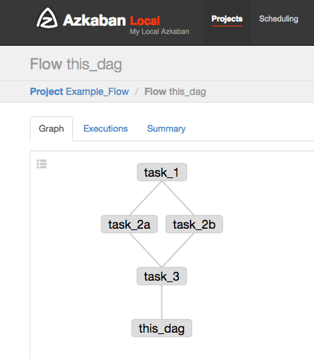

# Azflow #
Azflow translates the DAG-based programming model of [Airflow](https://github.com/apache/incubator-airflow) into [Azkaban](https://azkaban.github.io/).

## Features ##
* Tasks get translated to Azkaban jobs with the task_id becoming the file name prefix. Only "command" jobs are currently supported via the BashOperator.
* A final "noop" task is created to represent the flow, with filename coming from the dag_id.
* Cycle-detection prevents invalid DAGs from being rendered.
* DAG structure may be printed during rendering.

## Usage ##
To produce the output found in the directory "example/example_flow", run:

`python -m azflow.render --dag_file example/example_dag.py --output_folder example/example_flow/ --print`.

Once example_flow is zipped and uploaded to Azkaban, it produces the following flow:

## Testing ##
`python -m unittest test.AzflowTest`

## Python Compatibility ##
Azflow has been tested using Python 3. 

## Installation ##
`pip install git+https://github.com/aslotnick/azflow.git`

## See Also ##
* [AzkabanCLI](https://github.com/mtth/azkaban)
* [Azkaban Examples](https://github.com/joeharris76/azkaban_examples)