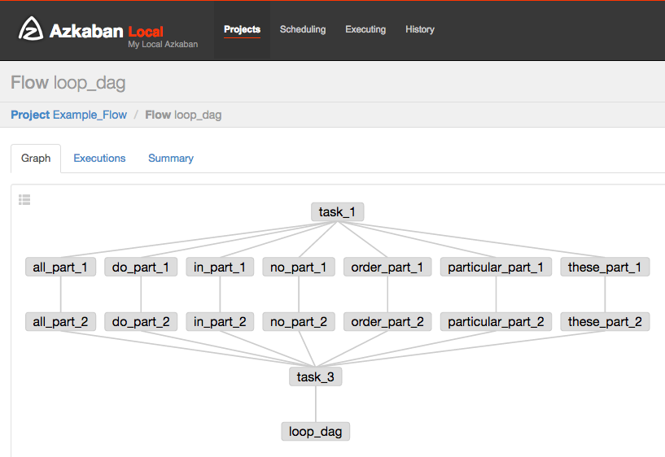

# [Azflow](https://github.com/aslotnick/azflow) #
Azflow translates the DAG-based programming model of [Airflow](https://github.com/apache/incubator-airflow) into [Azkaban](https://azkaban.github.io/) (*Disclaimer: Azflow is inspired by but not connected to these projects*).

## Why Azflow? ##
Azkaban is a great workflow management tool, but Airflow offers a more powerful programming model than Azkaban's one-file-per-task approach. Azflow's goal is to offer a layer of abstraction like Airflow's in order to create complex workflows without repeating oneself. Azflow lacks most of the features of these two tools and is not meant to replace either.

## Features ##
* Task objects are rendered as Azkaban job files with the task_id becoming the file name prefix. Only "command" jobs are currently supported via the BashOperator.
* A DAG object is rendered as a final "noop" task, which gives the Azkaban flow a name based on the dag_id.
* Azflow detects cycles to prevent invalid DAGs from being rendered.
* The DAG's structure may be printed during rendering.

## Usage ##
This is an example of a simple DAG:

*example_dag.py*
```Python
from azflow.DAG import DAG
from azflow.BashOperator import BashOperator

this_dag = DAG(dag_id='this_dag')

task_1 = BashOperator(task_id='task_1', dag=this_dag, 
                      bash_command='echo "task 1"')

task_2a = BashOperator(task_id='task_2a', dag=this_dag, 
                       bash_command='echo "task 2a"')
task_2a.set_upstream(task_1)

task_2b = BashOperator(task_id='task_2b', dag=this_dag, 
                       bash_command='echo "task 2b"')
task_2b.set_upstream(task_1)

task_3 = BashOperator(task_id='task_3', dag=this_dag, 
                      bash_command='echo "task 3"')
task_3.set_upstream(task_2a)
task_3.set_upstream(task_2b)
```
To produce the output found in the directory "example/example_flow" from this file, run:

`python -m azflow.render --dag_file example/example_dag.py --output_folder example/example_flow/ --print`.

Once example_flow is zipped and uploaded to Azkaban, it produces the following flow:


Since a flow (DAG) is expressed in Python, you can create more complex workflows by looping:

*example_dag_loop.py*
```Python
from azflow.DAG import DAG
from azflow.BashOperator import BashOperator

loop_dag = DAG(dag_id='loop_dag')

task_1 = BashOperator(task_id='task_1', dag=loop_dag, 
                      bash_command='echo "begin"')

task_3 = BashOperator(task_id='task_3', dag=loop_dag, 
                      bash_command='echo "clean up"')

tasks_to_loop = ['do', 'all', 'these', 'in', 'no','particular', 'order']
for t in tasks_to_loop:
    task_2a = BashOperator(task_id=t+'_part_1', dag=loop_dag, 
                       bash_command='echo "start {}"'.format(t))
    task_2a.set_upstream(task_1)

    task_2b = BashOperator(task_id=t+'_part_2', dag=loop_dag, 
                       bash_command='echo "finish {}"'.format(t))
    task_2b.set_upstream(task_2a)
    task_3.set_upstream(task_2b)
```
`python -m azflow.render --dag_file example/example_dag_loop.py --output_folder example/example_flow_loop/ --print`



## Testing ##
`python -m unittest test.AzflowTest`

## Installation ##
`pip install git+https://github.com/aslotnick/azflow.git`

## See Also ##
* [AzkabanCLI](https://github.com/mtth/azkaban)
* [Azkaban Examples](https://github.com/joeharris76/azkaban_examples)
* [LinkedIn Gradle DSL for Apache Hadoop](https://github.com/linkedin/linkedin-gradle-plugin-for-apache-hadoop)
* [azkaban-rb](https://github.com/matthayes/azkaban-rb)